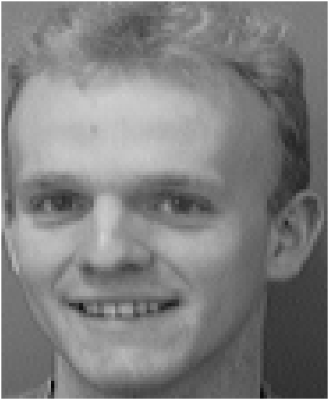
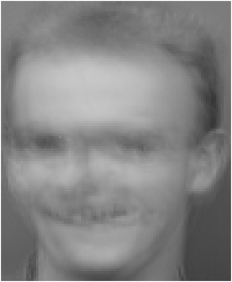
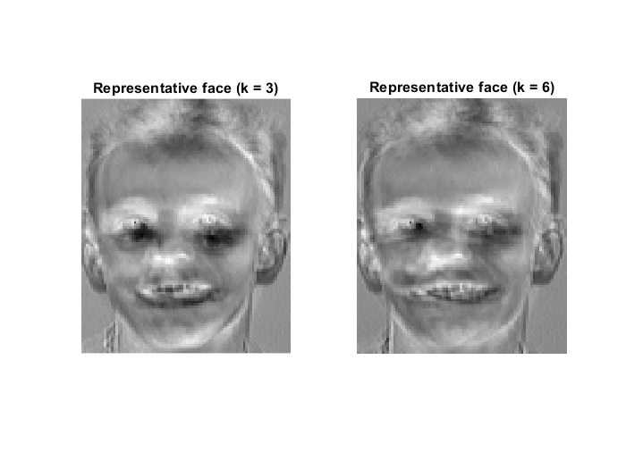
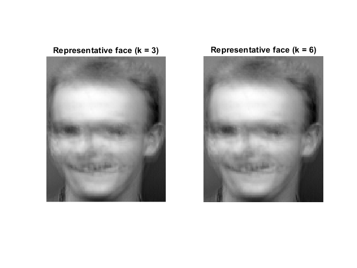
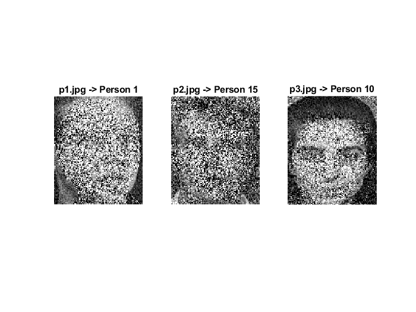

# eigenfaces-svd-recognition
Facial recognition, low-rank image reconstruction, and noise robustness evaluation using Singular Value Decomposition (SVD) and Principal Subspaces in MATLAB.

# Facial Recognition & Low-Rank Reconstruction via SVD (Eigenfaces)

[]()
[]()
[]()

An implementation of facial recognition and low-rank image approximation using Singular Value Decomposition (SVD) on the AT&T (ORL) Face Database. This repository demonstrates dimensionality reduction, eigenface subspace projection, and recognition robustness under severe noise degradation.

---

## 📌 Key Highlights
- **Theoretical Foundations:** Low-rank matrix approximation framed via the **Eckart–Young–Mirsky Theorem**.
- **Data Centering:** Mean face extraction to capture intra-class and inter-class geometric variations.
- **Dimensionality Reduction:** Compressing high-dimensional pixel spaces ($d \approx 10^4$) into compact $k$-dimensional principal subspaces.
- **Robustness Testing:** Evaluation of recognition accuracy on test faces degraded by heavy additive noise.

---

### Dataset Setup
This project benchmarks on the **AT&T (ORL) Database of Faces**:
1. Download the archive from the [Cambridge University Archive](https://www.cl.cam.ac.uk/research/dtg/attarchive/facedatabase.html) ([Direct Zip Download](https://www.cl.cam.ac.uk/research/dtg/attarchive/pub/data/att_faces.zip)).
2. Extract the subject folders (`s1`, `s2`, ...) into the `data/` directory.
3. Test probe images are pre-packaged under `data/recognition/`.

## 📐 Mathematical Formulation

### 1. Data Matrix Formulation & Centering
Let $N$ face images each of dimension $h \times w$ be vectorized into column vectors $x_i \in \mathbb{R}^{d}$, where $d = h \times w$. The mean face vector $\Psi$ is given by:

$$\Psi = \frac{1}{N} \sum_{i=1}^{N} x_i$$

The centered data matrix $A \in \mathbb{R}^{d \times N}$ is constructed by subtracting $\Psi$ from each column:

$$A = \begin{bmatrix} x_1 - \Psi & x_2 - \Psi & \cdots & x_N - \Psi \end{bmatrix}$$

### 2. Singular Value Decomposition (SVD)
The SVD of the centered matrix $A$ yields:

$$A = U \Sigma V^T = \sum_{i=1}^{r} \sigma_i u_i v_i^T$$

where:
- $U = [u_1, u_2, \dots, u_d] \in \mathbb{R}^{d \times d}$ contains the orthonormal eigenvectors of the sample covariance matrix $C \propto A A^T$ (**Eigenfaces**).
- $\Sigma = \operatorname{diag}(\sigma_1, \sigma_2, \dots) \in \mathbb{R}^{d \times N}$ holds the ordered singular values ($\sigma_1 \ge \sigma_2 \ge \dots \ge 0$).
- $V \in \mathbb{R}^{N \times N}$ contains the principal coordinate loadings.

### 3. Optimal Low-Rank Approximation
By the **Eckart–Young–Mirsky Theorem**, truncating the expansion to the top $k$ singular components ($k \ll r$) provides the optimal rank-$k$ estimate $A_k$ in terms of the Frobenius norm:

$$\min_{\operatorname{rank}(B) \le k} \Vert{}A - B\Vert{}_F = \Vert{}A - A_k\Vert{}_F = \sqrt{\sum_{i=k+1}^{\min(d,N)} \sigma_i^2}$$

Each centered image is projected onto the low-dimensional eigen-subspace $U_k = [u_1, \dots, u_k]$:

$$\Omega = U_k^T (x - \Psi)$$

Recognition of an unknown probe image $x_{\text{test}}$ is performed via Minimum Euclidean Distance classification against enrolled gallery representations:

$$\hat{y} = \arg\min_j \Vert{}\Omega_{\text{test}} - \Omega_j\Vert{}_2$$

---

## 🔬 Visual Results

### 1. Baseline & Mean Face
Vectorizing the dataset and computing the average pixel intensity yields the global "Mean Face" $\Psi$, which acts as the centering anchor for SVD:

| Original Sample Image (`s5/1.pgm`) | Mean Face ($\Psi$) |
| :---: | :---: |
|  |  |

---

### 2. Subspace Projection & Face Reconstruction
Reconstructing the face with truncated singular components ($k = 3$ vs $k = 6$). Adding the mean face back synthesizes the actual facial identity:

| Subspace Components ($\sum_{i=1}^k \sigma_i u_i$) | Full Reconstruction (Components + $\Psi$) |
| :---: | :---: |
|  |  |

---

## 🛡️ Robustness Against Severe Noise
To evaluate classification stability, probe images contaminated with heavy synthetic additive noise were projected onto the eigen-subspace.



Despite high corruption where localized pixel features are destroyed, global subspace projection correctly identified:
- `p1.jpg` $\rightarrow$ **Person 1**
- `p2.jpg` $\rightarrow$ **Person 15**
- `p3.jpg` $\rightarrow$ **Person 10**
---

## 📂 Repository Structure

```text
├── assets/                          # Result visualizations and demo plots
│   ├── mean_face.png
│   ├── reconstruction_comparison.png
│   └── noise_robustness.png
├── data/                            # AT&T (ORL) database directory (optional/download script)
├── src/
│   ├── load_dataset.m               # Vectorization and preprocessing of PGM files
│   ├── compute_eigenfaces.m         # Mean computation and SVD decomposition
│   ├── reconstruct_face.m           # Low-rank subspace reconstruction
│   └── classify_probe.m             # Subspace projection and 1-NN identification
├── main.m                           # End-to-end execution pipeline
├── README.md
└── LICENSE
